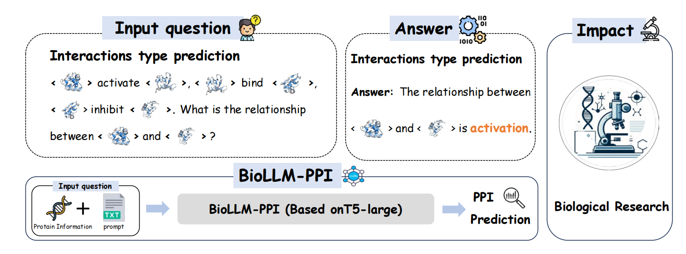
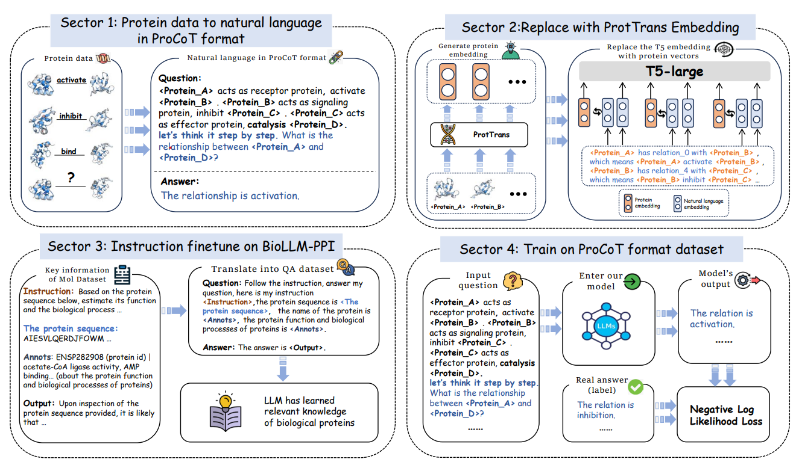
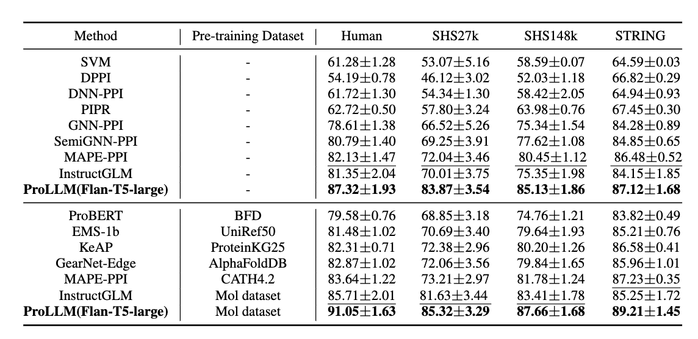

# ProLLM: Protein Chain-of-Thoughts Enhanced LLM for Protein-Protein Interaction Prediction
This repo presents implementation of the **ProLLM🧬** 
<div align=center></div>


We present **Protein Chain-of-Thoughts Enhanced LLM for Protein-Protein Interaction Prediction**, abbreviated as **ProLLM**. This innovative framework leverages the advanced capabilities of Large Language Models (LLMs) to interpret and analyze protein sequences and interactions through a natural language processing lens. 

## Key Features of ProLLM🔑

- **Protein Chain of Thought (ProCoT) Method**: BioLLM-PPI introduces the Protein Chain of Thought (ProCoT) method, transforming the complex, structured data of protein interactions into intuitive, natural language prompts. 

- **Enhanced Predictive Accuracy**: This approach not only facilitates a deeper understanding of protein functions and interactions but also enhances the model's predictive accuracy by incorporating protein-specific embeddings and instruction fine-tuning on domain-specific datasets.
<div align=center></div>

## Requirements

```
pip install -r requirements.txt
```

## Usage🧰

  

0. Clone this repo

  

```
git clone https://github.com/MingyuJ666/ProLLM.git
```
### train🧑‍💻
1. Download [SHS27K, SHS148K, STRING](https://drive.google.com/file/d/1hJVrQXddB9JK68z7jlIcLfd9AmTWwgJr/view?usp=drive_link) and [Human](https://drive.google.com/drive/folders/1hT_lAZUB0p-8AuV7x8BCa8cltlhSQpmQ?usp=drive_link)

2. Preprocess the dataset into Protein Chain of Thought (ProCoT) by the [dataset]_preprocess.py
```
python [dataset]_preprocess.py
```

3. Do training through train_ProLLM.py , make sure the location of model and tokenizer in right place. Feel free to change 'num_epochs', 'batch_size' and 'learning_rate'.
```
python train_ProLLM.py --model_dir /path/to/model/dir --tokenizer_dir /path/to/tokenizer/dir --data_file dataset.csv --num_epochs 1 --batch_size 2 --learning_rate 3e-4 --output_dir /path/to/output/dir
```

6. Evaluate through eva_ProLLM.py , the model to evaluate should be the location of the training model from step 3.

```
python eva_ProLLM.py --model_path /path/to/model/dir --csv_path /path/to/testdata
```

## Checkpoint 
See: [Google Drive link](https://drive.google.com/drive/folders/1mHGdE0x57pX2ie6U4BJxZg5w3KL2SWa7?usp=drive_link).


## Evaluation
### Compare our model with other PPI models
<div align=center></div>

