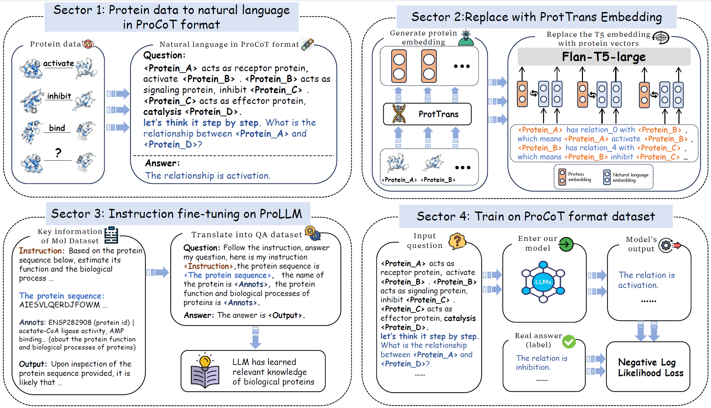

# ProLLM: Protein Chain-of-Thoughts Enhanced LLM for Protein-Protein Interaction Prediction
This repo presents the implementation of the **ProLLM🧬** 

The paper has been accepted by **COLM 2024**. 

Paper link: https://openreview.net/forum?id=2nTzomzjjb#discussion

Arxiv link: https://arxiv.org/abs/2405.06649
<div align=center></div>


We present **Protein Chain-of-Thoughts Enhanced LLM for Protein-Protein Interaction Prediction**, abbreviated as **ProLLM**. This innovative framework leverages the advanced capabilities of Large Language Models (LLMs) to interpret and analyze protein sequences and interactions through a natural language processing lens. 

## Key Features of ProLLM🔑

- **Protein Chain of Thought (ProCoT) Method**: ProLLM introduces the Protein Chain of Thought (ProCoT) method, transforming the complex, structured data of protein interactions into intuitive, natural language prompts. 

- **Enhanced Predictive Accuracy**: This approach not only facilitates a deeper understanding of protein functions and interactions but also enhances the model's predictive accuracy by incorporating protein-specific embeddings and instruction fine-tuning on domain-specific datasets.
<div align=center></div>

## Requirements

```
pip install -r requirements.txt
```

## Usage🧰

  
### Dataset🧑‍💻
1. Download [SHS27K, SHS148K, STRING and Human](https://drive.google.com/drive/folders/19h8ekwKjvSS48Il_AQbUMfi8nDeCuivu?usp=sharing)

### Preprocess

2. Preprocess the dataset into Protein Chain of Thought (ProCoT) by the ./data_preprocess/[dataset_name]/preprocess.py
```
python [dataset]_preprocess.py
```

### Embedding replacement
3. Do the embedding replacement in [./embedding_replacement](./embedding_replacement)

### Instruction finturning
4. Instruction fintuning in [./Instruction_fintuning](./Instruction_fintuning)

### train🧑‍💻

5. Do training through [train_ProLLM.py](./train_ProLLM.py) , make sure the location of model and tokenizer in right place. Feel free to change 'num_epochs', 'batch_size' and 'learning_rate'.
```
python train_ProLLM.py --model_dir /path/to/model/dir --tokenizer_dir /path/to/tokenizer/dir --data_file dataset.csv --num_epochs 1 --batch_size 2 --learning_rate 3e-4 --output_dir /path/to/output/dir
```


## Citation 
If you find this paper helpful, please consider to cite:
```
@inproceedings{
jin2024prollm,
title={Pro{LLM}: Protein Chain-of-Thoughts Enhanced {LLM} for Protein-Protein Interaction Prediction},
author={Mingyu Jin and Haochen Xue and Zhenting Wang and Boming Kang and Ruosong Ye and Kaixiong Zhou and Mengnan Du and Yongfeng Zhang},
booktitle={First Conference on Language Modeling},
year={2024},
url={https://openreview.net/forum?id=2nTzomzjjb}
}
```

```
@article{jin2024prollm,
  title={ProLLM: Protein Chain-of-Thoughts Enhanced LLM for Protein-Protein Interaction Prediction},
  author={Jin, Mingyu and Xue, Haochen and Wang, Zhenting and Kang, Boming and Ye, Ruosong and Zhou, Kaixiong and Du, Mengnan and Zhang, Yongfeng},
  journal={arXiv e-prints},
  pages={arXiv--2405},
  year={2024}
}
```
